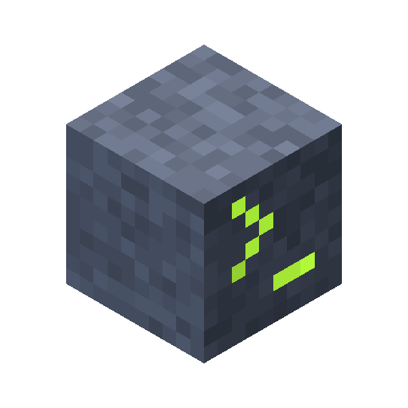
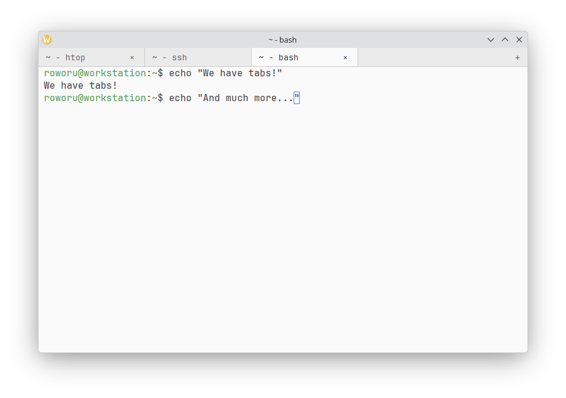
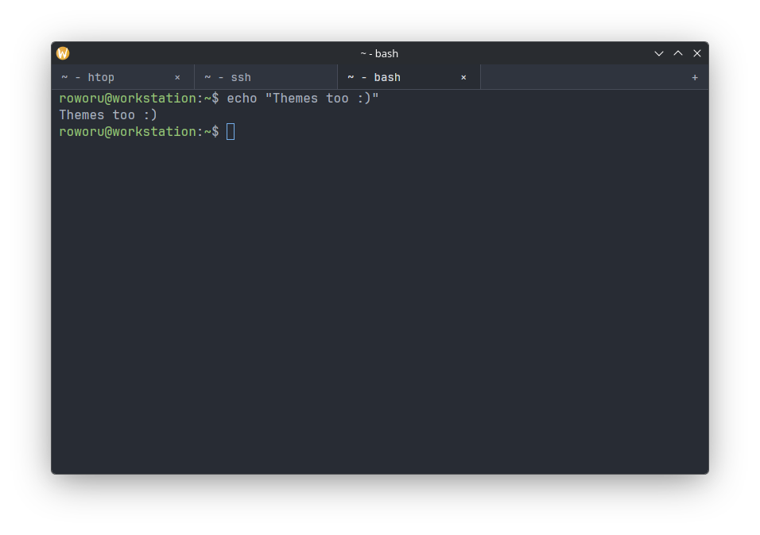

[](https://github.com/roworu/kuterm/actions/workflows/test.yml)
[](https://github.com/roworu/kuterm/actions/workflows/release.yml)
[](https://scorecard.dev/viewer/?uri=github.com/roworu/kuterm)

highly configurable, gpu accelerated terminal

<br clear="right">

## installation

download binaries for linux, macos or windows from [releases](https://github.com/roworu/kuterm/releases).

or build from source:

```bash
cargo build --release
```

## settings

config lives in `~/.config/kuterm/` (or whatever is your `$XDG_CONFIG_HOME`) and is created with defaults on first launch:

- `settings.jsonc`: fonts, tabs, titles, shell, cursor, theme
- `keybindings.jsonc`: keys for each action, `null` disables
- `commands.jsonc`: command palette (ctrl-shift-p) commands, add your own there
- `themes/dark.jsonc`, `themes/light.jsonc`: color shemas

each option described in file with comments, you don't need any external docs to set it up.

partial changes work, missing values use defaults. you can just override things you need and remove others, to accept defaults.

you can check default settings used by terminal inside that repo: [Settings](https://github.com/roworu/kuterm/tree/main/assets)

## screenshots





## development

needed build tasks for `zed` and `vscode` are in according folders:

- `podman: build + test`: build and test dev version inside a podman (to not rely on system packages)
- `run app`: run that dev build from `./target/podman/debug/kuterm`
